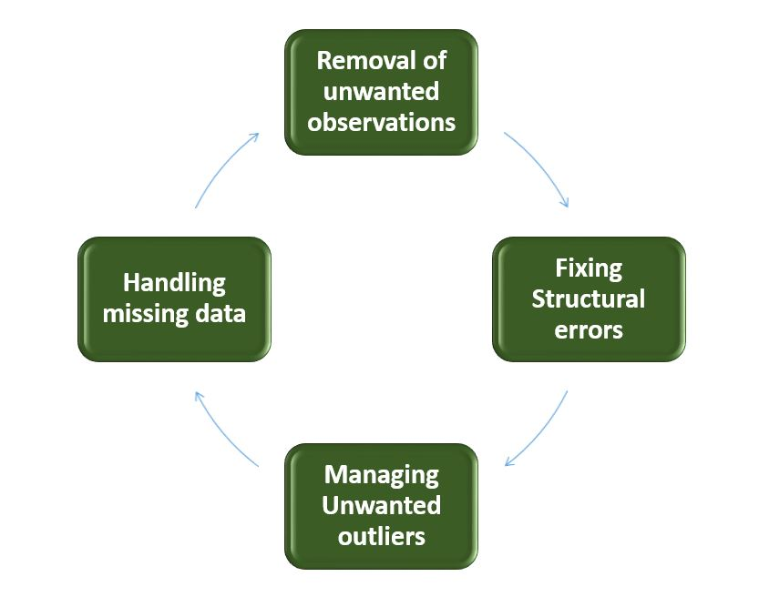

<h3> Handling Missing values </h3>

             
             1 . Mean-Median_Mode
             2 . Arbitary Imputation technique
             3 . End-of-distribution tecnnique
             4 . Complete case analysis
             5 . Frequent category imputaton
         

